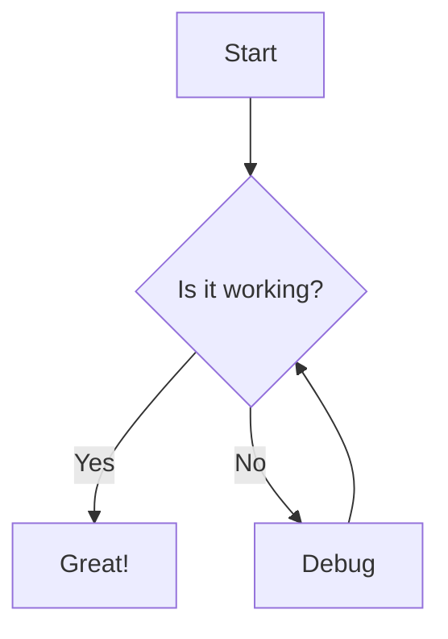
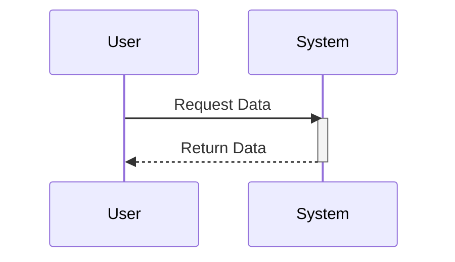
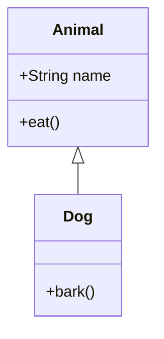
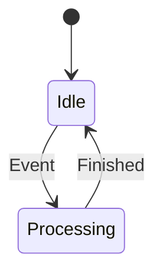
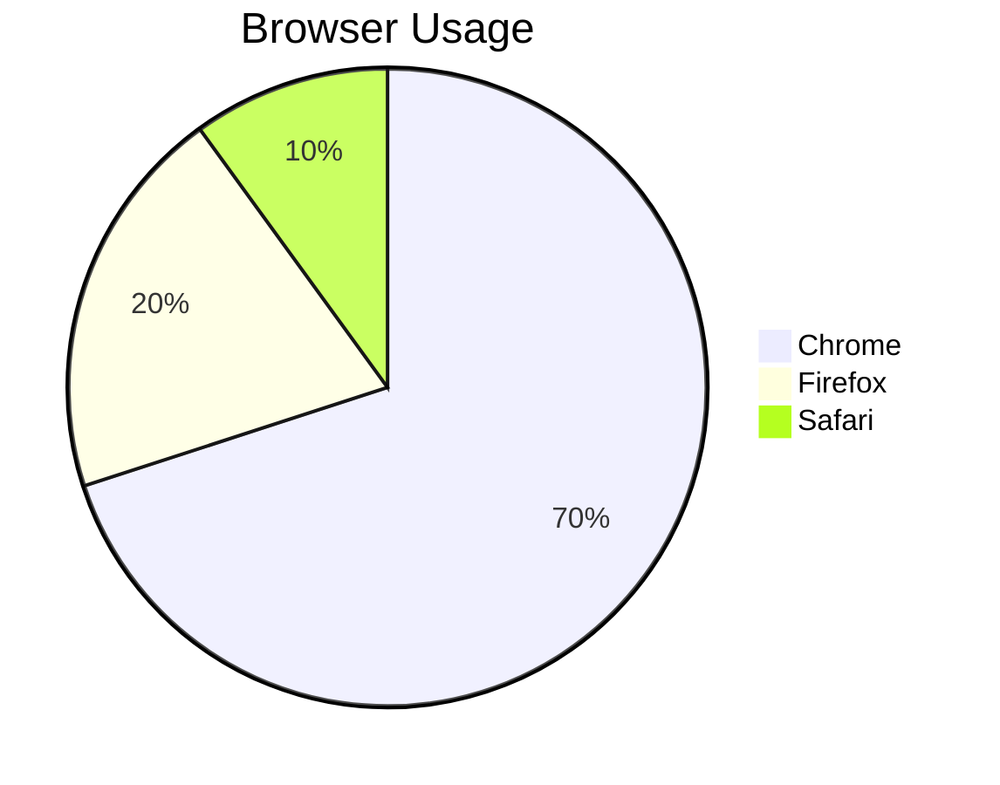
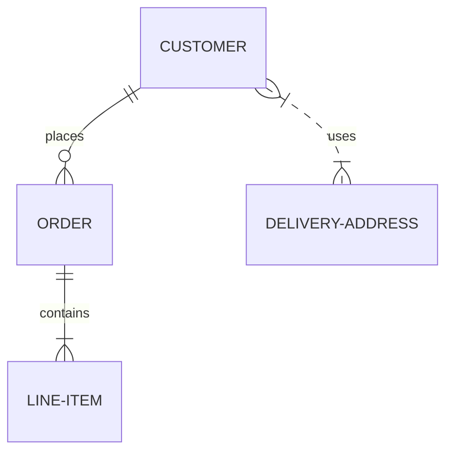
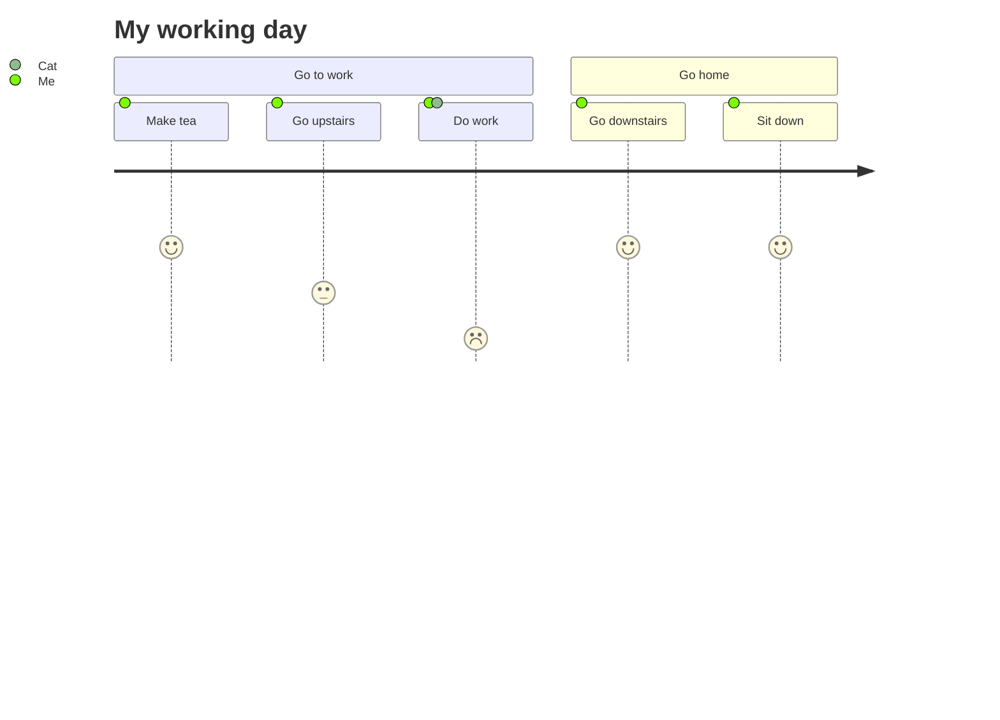

This post demonstrates the Mermaid diagram integration. The code blocks below are rendered with a tab interface allowing you to switch between the Mermaid source code and the rendered diagram.

## Flowchart

## Sequence Diagram

## Class Diagram

## State Diagram

## Pie Chart

## Entity Relationship Diagram

## User Journey

